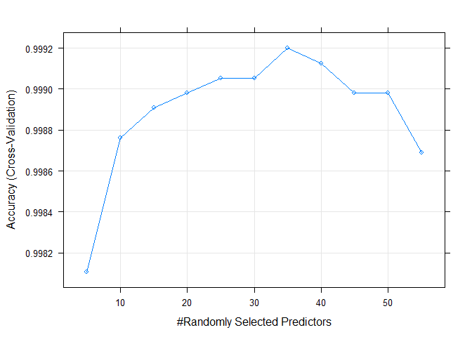

# Synopsis

Using devices such as Jawbone Up, Nike FuelBand, and Fitbit it is now possible to collect a large amount of data about personal activity relatively inexpensively. These types of devices are part of the quantified self movement – a group of enthusiasts who take measurements about themselves regularly to improve their health, to find patterns in their behavior, or because they are tech geeks.

One thing that people regularly do is quantify how much of a particular activity they do, but they rarely quantify how well they do it. In this project, our goal will be to use data from accelerometers on the belt, forearm, arm, and dumbbell of 6 participants, to predict the manner in which they did their exercises.

# Data preparation 

Let's start by loading the libraries and datasets we'll use throughout the project.


```r
## Load libraries

library(tidyverse)
library(caret)
library(skimr)

## Check if raw data files exist in the working directory, otherwise, download them.

if(!file.exists("pml-testing.csv")){
  download.file("https://d396qusza40orc.cloudfront.net/predmachlearn/pml-testing.csv","pml-testing.csv")
}


if(!file.exists("pml-training.csv")){
  download.file("https://d396qusza40orc.cloudfront.net/predmachlearn/pml-training.csv","pml-training.csv")  
}

## Read cvs files into R

pml_test_cases_to_predict <- read_csv("pml-testing.csv",
                                       col_types = cols(.default=col_double(),
                                                        X1 = col_skip(), ## first col contains row id, not necessary
                                                        user_name=col_factor(),
                                                        new_window=col_factor(),
                                                        cvtd_timestamp = col_datetime(format = "%d/%m/%Y %H:%M")),
                                       na = c(NA,"#DIV/0!"))


pml_training <- read_csv("pml-training.csv", 
                         col_types = cols(.default=col_double(),
                                          X1 = col_skip(), ## first col contains row id, not necessary
                                          user_name=col_factor(),
                                          new_window=col_factor(),
                                          cvtd_timestamp = col_datetime(format = "%d/%m/%Y %H:%M"),
                                          classe=col_factor()),
                         na = c(NA,"#DIV/0!"))
```

Now that our data is loaded, let's take a few summary statistics of the pml_training set, to see if there's any variable coded with a wrong data type and/or any missing data.


```r
skim(pml_training)
```


Table: Data summary

|                         |             |
|:------------------------|:------------|
|Name                     |pml_training |
|Number of rows           |19622        |
|Number of columns        |159          |
|_______________________  |             |
|Column type frequency:   |             |
|factor                   |3            |
|numeric                  |155          |
|POSIXct                  |1            |
|________________________ |             |
|Group variables          |None         |


**Variable type: factor**

|skim_variable | n_missing| complete_rate|ordered | n_unique|top_counts                                 |
|:-------------|---------:|-------------:|:-------|--------:|:------------------------------------------|
|user_name     |         0|             1|FALSE   |        6|ade: 3892, cha: 3536, jer: 3402, car: 3112 |
|new_window    |         0|             1|FALSE   |        2|no: 19216, yes: 406                        |
|classe        |         0|             1|FALSE   |        5|A: 5580, B: 3797, E: 3607, C: 3422         |


**Variable type: numeric**

|skim_variable            | n_missing| complete_rate|          mean|        sd|           p0|           p25|           p50|           p75|         p100|hist                                     |
|:------------------------|---------:|-------------:|-------------:|---------:|------------:|-------------:|-------------:|-------------:|------------:|:----------------------------------------|
|raw_timestamp_part_1     |         0|          1.00| 1322827119.27| 204927.68|  1.32249e+09| 1322673099.00| 1322832920.00| 1323084264.00| 1.323095e+09|▃▃▇▁▆ |
|raw_timestamp_part_2     |         0|          1.00|     500656.14| 288222.88|  2.94000e+02|     252912.25|     496380.00|     751890.75| 9.988010e+05|▇▇▇▇▇ |
|num_window               |         0|          1.00|        430.64|    247.91|  1.00000e+00|        222.00|        424.00|        644.00| 8.640000e+02|▇▇▇▇▇ |
|roll_belt                |         0|          1.00|         64.41|     62.75| -2.89000e+01|          1.10|        113.00|        123.00| 1.620000e+02|▇▁▁▅▅ |
|pitch_belt               |         0|          1.00|          0.31|     22.35| -5.58000e+01|          1.76|          5.28|         14.90| 6.030000e+01|▃▁▇▅▁ |
|yaw_belt                 |         0|          1.00|        -11.21|     95.19| -1.80000e+02|        -88.30|        -13.00|         12.90| 1.790000e+02|▁▇▅▁▃ |
|total_accel_belt         |         0|          1.00|         11.31|      7.74|  0.00000e+00|          3.00|         17.00|         18.00| 2.900000e+01|▇▁▂▆▁ |
|kurtosis_roll_belt       |     19226|          0.02|         -0.22|      2.92| -2.12000e+00|         -1.33|         -0.90|         -0.22| 3.300000e+01|▇▁▁▁▁ |
|kurtosis_picth_belt      |     19248|          0.02|          4.33|     11.58| -2.19000e+00|         -1.11|         -0.15|          3.18| 5.800000e+01|▇▁▁▁▁ |
|kurtosis_yaw_belt        |     19622|          0.00|           NaN|        NA|           NA|            NA|            NA|            NA|           NA|                                         |
|skewness_roll_belt       |     19225|          0.02|         -0.03|      0.92| -5.74000e+00|         -0.44|          0.00|          0.42| 3.600000e+00|▁▁▆▇▁ |
|skewness_roll_belt.1     |     19248|          0.02|         -0.30|      2.26| -7.62000e+00|         -1.11|         -0.07|          0.66| 7.350000e+00|▁▂▇▁▁ |
|skewness_yaw_belt        |     19622|          0.00|           NaN|        NA|           NA|            NA|            NA|            NA|           NA|                                         |
|max_roll_belt            |     19216|          0.02|         -6.67|     94.59| -9.43000e+01|        -88.00|         -5.10|         18.50| 1.800000e+02|▇▅▁▁▃ |
|max_picth_belt           |     19216|          0.02|         12.92|      8.01|  3.00000e+00|          5.00|         18.00|         19.00| 3.000000e+01|▇▁▆▃▁ |
|max_yaw_belt             |     19226|          0.02|         -0.22|      2.92| -2.10000e+00|         -1.30|         -0.90|         -0.20| 3.300000e+01|▇▁▁▁▁ |
|min_roll_belt            |     19216|          0.02|        -10.44|     93.62| -1.80000e+02|        -88.40|         -7.85|          9.05| 1.730000e+02|▁▇▅▁▃ |
|min_pitch_belt           |     19216|          0.02|         10.76|      7.47|  0.00000e+00|          3.00|         16.00|         17.00| 2.300000e+01|▇▁▁▇▂ |
|min_yaw_belt             |     19226|          0.02|         -0.22|      2.92| -2.10000e+00|         -1.30|         -0.90|         -0.20| 3.300000e+01|▇▁▁▁▁ |
|amplitude_roll_belt      |     19216|          0.02|          3.77|     25.26|  0.00000e+00|          0.30|          1.00|          2.08| 3.600000e+02|▇▁▁▁▁ |
|amplitude_pitch_belt     |     19216|          0.02|          2.17|      2.36|  0.00000e+00|          1.00|          1.00|          2.00| 1.200000e+01|▇▁▁▁▁ |
|amplitude_yaw_belt       |     19226|          0.02|          0.00|      0.00|  0.00000e+00|          0.00|          0.00|          0.00| 0.000000e+00|▁▁▇▁▁ |
|var_total_accel_belt     |     19216|          0.02|          0.93|      2.22|  0.00000e+00|          0.10|          0.20|          0.30| 1.650000e+01|▇▁▁▁▁ |
|avg_roll_belt            |     19216|          0.02|         68.06|     63.14| -2.74000e+01|          1.10|        116.35|        123.38| 1.574000e+02|▇▁▁▃▆ |
|stddev_roll_belt         |     19216|          0.02|          1.34|      2.44|  0.00000e+00|          0.20|          0.40|          0.70| 1.420000e+01|▇▁▁▁▁ |
|var_roll_belt            |     19216|          0.02|          7.70|     23.16|  0.00000e+00|          0.00|          0.10|          0.50| 2.007000e+02|▇▁▁▁▁ |
|avg_pitch_belt           |     19216|          0.02|          0.52|     22.41| -5.14000e+01|          2.02|          5.20|         15.78| 5.970000e+01|▃▁▇▃▁ |
|stddev_pitch_belt        |     19216|          0.02|          0.60|      0.64|  0.00000e+00|          0.20|          0.40|          0.70| 4.000000e+00|▇▁▁▁▁ |
|var_pitch_belt           |     19216|          0.02|          0.77|      1.76|  0.00000e+00|          0.00|          0.10|          0.50| 1.620000e+01|▇▁▁▁▁ |
|avg_yaw_belt             |     19216|          0.02|         -8.83|     93.48| -1.38300e+02|        -88.18|         -6.55|         14.12| 1.735000e+02|▇▁▅▁▃ |
|stddev_yaw_belt          |     19216|          0.02|          1.34|     10.29|  0.00000e+00|          0.10|          0.30|          0.70| 1.766000e+02|▇▁▁▁▁ |
|var_yaw_belt             |     19216|          0.02|        107.49|   1655.52|  0.00000e+00|          0.01|          0.09|          0.48| 3.118324e+04|▇▁▁▁▁ |
|gyros_belt_x             |         0|          1.00|         -0.01|      0.21| -1.04000e+00|         -0.03|          0.03|          0.11| 2.220000e+00|▁▇▁▁▁ |
|gyros_belt_y             |         0|          1.00|          0.04|      0.08| -6.40000e-01|          0.00|          0.02|          0.11| 6.400000e-01|▁▁▇▁▁ |
|gyros_belt_z             |         0|          1.00|         -0.13|      0.24| -1.46000e+00|         -0.20|         -0.10|         -0.02| 1.620000e+00|▁▂▇▁▁ |
|accel_belt_x             |         0|          1.00|         -5.59|     29.64| -1.20000e+02|        -21.00|        -15.00|         -5.00| 8.500000e+01|▁▁▇▁▂ |
|accel_belt_y             |         0|          1.00|         30.15|     28.58| -6.90000e+01|          3.00|         35.00|         61.00| 1.640000e+02|▁▇▇▁▁ |
|accel_belt_z             |         0|          1.00|        -72.59|    100.45| -2.75000e+02|       -162.00|       -152.00|         27.00| 1.050000e+02|▁▇▁▅▃ |
|magnet_belt_x            |         0|          1.00|         55.60|     64.18| -5.20000e+01|          9.00|         35.00|         59.00| 4.850000e+02|▇▁▂▁▁ |
|magnet_belt_y            |         0|          1.00|        593.68|     35.68|  3.54000e+02|        581.00|        601.00|        610.00| 6.730000e+02|▁▁▁▇▃ |
|magnet_belt_z            |         0|          1.00|       -345.48|     65.21| -6.23000e+02|       -375.00|       -320.00|       -306.00| 2.930000e+02|▁▇▁▁▁ |
|roll_arm                 |         0|          1.00|         17.83|     72.74| -1.80000e+02|        -31.78|          0.00|         77.30| 1.800000e+02|▁▃▇▆▂ |
|pitch_arm                |         0|          1.00|         -4.61|     30.68| -8.88000e+01|        -25.90|          0.00|         11.20| 8.850000e+01|▁▅▇▂▁ |
|yaw_arm                  |         0|          1.00|         -0.62|     71.36| -1.80000e+02|        -43.10|          0.00|         45.88| 1.800000e+02|▁▃▇▃▂ |
|total_accel_arm          |         0|          1.00|         25.51|     10.52|  1.00000e+00|         17.00|         27.00|         33.00| 6.600000e+01|▃▆▇▁▁ |
|var_accel_arm            |     19216|          0.02|         53.24|     53.98|  0.00000e+00|          9.03|         40.61|         75.62| 3.317000e+02|▇▂▁▁▁ |
|avg_roll_arm             |     19216|          0.02|         12.68|     68.58| -1.66670e+02|        -38.37|          0.00|         76.32| 1.633300e+02|▁▅▇▅▃ |
|stddev_roll_arm          |     19216|          0.02|         11.20|     17.10|  0.00000e+00|          1.38|          5.70|         14.92| 1.619600e+02|▇▁▁▁▁ |
|var_roll_arm             |     19216|          0.02|        417.26|   2007.16|  0.00000e+00|          1.90|         32.52|        222.65| 2.623221e+04|▇▁▁▁▁ |
|avg_pitch_arm            |     19216|          0.02|         -4.90|     26.83| -8.17700e+01|        -22.77|          0.00|          8.28| 7.566000e+01|▁▃▇▂▁ |
|stddev_pitch_arm         |     19216|          0.02|         10.38|      9.40|  0.00000e+00|          1.64|          8.13|         16.33| 4.341000e+01|▇▅▂▁▁ |
|var_pitch_arm            |     19216|          0.02|        195.86|    292.60|  0.00000e+00|          2.70|         66.15|        266.58| 1.884560e+03|▇▁▁▁▁ |
|avg_yaw_arm              |     19216|          0.02|          2.36|     61.33| -1.73440e+02|        -29.20|          0.00|         38.18| 1.520000e+02|▁▂▇▃▂ |
|stddev_yaw_arm           |     19216|          0.02|         22.27|     23.69|  0.00000e+00|          2.58|         16.68|         35.98| 1.770400e+02|▇▂▁▁▁ |
|var_yaw_arm              |     19216|          0.02|       1055.93|   2722.17|  0.00000e+00|          6.64|        278.31|       1294.85| 3.134457e+04|▇▁▁▁▁ |
|gyros_arm_x              |         0|          1.00|          0.04|      1.99| -6.37000e+00|         -1.33|          0.08|          1.57| 4.870000e+00|▁▃▇▆▂ |
|gyros_arm_y              |         0|          1.00|         -0.26|      0.85| -3.44000e+00|         -0.80|         -0.24|          0.14| 2.840000e+00|▁▂▇▂▁ |
|gyros_arm_z              |         0|          1.00|          0.27|      0.55| -2.33000e+00|         -0.07|          0.23|          0.72| 3.020000e+00|▁▂▇▂▁ |
|accel_arm_x              |         0|          1.00|        -60.24|    182.04| -4.04000e+02|       -242.00|        -44.00|         84.00| 4.370000e+02|▇▅▇▅▁ |
|accel_arm_y              |         0|          1.00|         32.60|    109.87| -3.18000e+02|        -54.00|         14.00|        139.00| 3.080000e+02|▁▃▇▆▂ |
|accel_arm_z              |         0|          1.00|        -71.25|    134.65| -6.36000e+02|       -143.00|        -47.00|         23.00| 2.920000e+02|▁▁▅▇▁ |
|magnet_arm_x             |         0|          1.00|        191.72|    443.64| -5.84000e+02|       -300.00|        289.00|        637.00| 7.820000e+02|▆▃▂▃▇ |
|magnet_arm_y             |         0|          1.00|        156.61|    201.91| -3.92000e+02|         -9.00|        202.00|        323.00| 5.830000e+02|▁▅▅▇▂ |
|magnet_arm_z             |         0|          1.00|        306.49|    326.62| -5.97000e+02|        131.25|        444.00|        545.00| 6.940000e+02|▁▂▂▃▇ |
|kurtosis_roll_arm        |     19294|          0.02|         -0.37|      2.05| -1.81000e+00|         -1.35|         -0.89|         -0.04| 2.146000e+01|▇▁▁▁▁ |
|kurtosis_picth_arm       |     19296|          0.02|         -0.54|      1.73| -2.08000e+00|         -1.28|         -1.01|         -0.38| 1.975000e+01|▇▁▁▁▁ |
|kurtosis_yaw_arm         |     19227|          0.02|          0.41|      5.67| -2.10000e+00|         -1.22|         -0.73|          0.12| 5.600000e+01|▇▁▁▁▁ |
|skewness_roll_arm        |     19293|          0.02|          0.07|      0.91| -2.54000e+00|         -0.56|          0.04|          0.67| 4.390000e+00|▁▇▆▁▁ |
|skewness_pitch_arm       |     19296|          0.02|         -0.06|      0.83| -4.57000e+00|         -0.62|         -0.03|          0.45| 3.040000e+00|▁▁▇▇▁ |
|skewness_yaw_arm         |     19227|          0.02|         -0.23|      1.18| -6.71000e+00|         -0.74|         -0.13|          0.34| 7.480000e+00|▁▂▇▁▁ |
|max_roll_arm             |     19216|          0.02|         11.24|     26.93| -7.31000e+01|         -0.18|          4.95|         26.78| 8.550000e+01|▁▂▇▃▁ |
|max_picth_arm            |     19216|          0.02|         35.75|     69.62| -1.73000e+02|         -1.98|         23.25|         95.97| 1.800000e+02|▁▂▇▆▃ |
|max_yaw_arm              |     19216|          0.02|         35.46|     10.45|  4.00000e+00|         29.00|         34.00|         41.00| 6.500000e+01|▁▂▇▃▁ |
|min_roll_arm             |     19216|          0.02|        -21.22|     28.72| -8.91000e+01|        -41.98|        -22.45|          0.00| 6.640000e+01|▂▆▇▂▁ |
|min_pitch_arm            |     19216|          0.02|        -33.92|     60.83| -1.80000e+02|        -72.62|        -33.85|          0.00| 1.520000e+02|▁▆▇▂▁ |
|min_yaw_arm              |     19216|          0.02|         14.67|      9.11|  1.00000e+00|          8.00|         13.00|         19.00| 3.800000e+01|▆▇▃▂▂ |
|amplitude_roll_arm       |     19216|          0.02|         32.45|     27.39|  0.00000e+00|          5.43|         28.45|         50.96| 1.195000e+02|▇▆▃▁▁ |
|amplitude_pitch_arm      |     19216|          0.02|         69.68|     66.98|  0.00000e+00|          9.93|         54.90|        115.17| 3.600000e+02|▇▅▂▁▁ |
|amplitude_yaw_arm        |     19216|          0.02|         20.79|     12.28|  0.00000e+00|         13.00|         22.00|         28.75| 5.200000e+01|▅▅▇▃▁ |
|roll_dumbbell            |         0|          1.00|         23.84|     69.93| -1.53710e+02|        -18.49|         48.17|         67.61| 1.535500e+02|▂▂▃▇▂ |
|pitch_dumbbell           |         0|          1.00|        -10.78|     36.99| -1.49590e+02|        -40.89|        -20.96|         17.50| 1.494000e+02|▁▆▇▂▁ |
|yaw_dumbbell             |         0|          1.00|          1.67|     82.52| -1.50870e+02|        -77.64|         -3.32|         79.64| 1.549500e+02|▃▇▅▅▆ |
|kurtosis_roll_dumbbell   |     19221|          0.02|          0.45|      3.19| -2.17000e+00|         -0.68|         -0.03|          0.94| 5.500000e+01|▇▁▁▁▁ |
|kurtosis_picth_dumbbell  |     19218|          0.02|          0.29|      3.30| -2.20000e+00|         -0.72|         -0.13|          0.58| 5.563000e+01|▇▁▁▁▁ |
|kurtosis_yaw_dumbbell    |     19622|          0.00|           NaN|        NA|           NA|            NA|            NA|            NA|           NA|                                         |
|skewness_roll_dumbbell   |     19220|          0.02|         -0.12|      0.82| -7.38000e+00|         -0.58|         -0.08|          0.40| 1.960000e+00|▁▁▁▇▆ |
|skewness_pitch_dumbbell  |     19217|          0.02|         -0.03|      0.86| -7.45000e+00|         -0.53|         -0.09|          0.51| 3.770000e+00|▁▁▂▇▁ |
|skewness_yaw_dumbbell    |     19622|          0.00|           NaN|        NA|           NA|            NA|            NA|            NA|           NA|                                         |
|max_roll_dumbbell        |     19216|          0.02|         13.76|     48.30| -7.01000e+01|        -27.15|         14.85|         50.58| 1.370000e+02|▆▇▇▅▂ |
|max_picth_dumbbell       |     19216|          0.02|         32.75|     93.37| -1.12900e+02|        -66.70|         40.05|        133.23| 1.550000e+02|▆▃▂▂▇ |
|max_yaw_dumbbell         |     19221|          0.02|          0.45|      3.19| -2.20000e+00|         -0.70|          0.00|          0.90| 5.500000e+01|▇▁▁▁▁ |
|min_roll_dumbbell        |     19216|          0.02|        -41.24|     34.71| -1.49600e+02|        -59.68|        -43.55|        -25.20| 7.320000e+01|▁▃▇▃▁ |
|min_pitch_dumbbell       |     19216|          0.02|        -33.18|     74.28| -1.47000e+02|        -91.80|        -66.15|         21.20| 1.209000e+02|▆▇▅▃▃ |
|min_yaw_dumbbell         |     19221|          0.02|          0.45|      3.19| -2.20000e+00|         -0.70|          0.00|          0.90| 5.500000e+01|▇▁▁▁▁ |
|amplitude_roll_dumbbell  |     19216|          0.02|         55.00|     54.94|  0.00000e+00|         14.97|         35.05|         81.04| 2.564800e+02|▇▂▁▁▁ |
|amplitude_pitch_dumbbell |     19216|          0.02|         65.93|     65.23|  0.00000e+00|         17.06|         41.72|         99.54| 2.735900e+02|▇▂▂▁▁ |
|amplitude_yaw_dumbbell   |     19221|          0.02|          0.00|      0.00|  0.00000e+00|          0.00|          0.00|          0.00| 0.000000e+00|▁▁▇▁▁ |
|total_accel_dumbbell     |         0|          1.00|         13.72|     10.23|  0.00000e+00|          4.00|         10.00|         19.00| 5.800000e+01|▇▅▃▁▁ |
|var_accel_dumbbell       |     19216|          0.02|          4.39|     13.51|  0.00000e+00|          0.38|          1.00|          3.43| 2.304300e+02|▇▁▁▁▁ |
|avg_roll_dumbbell        |     19216|          0.02|         23.86|     62.90| -1.28960e+02|        -12.33|         48.23|         64.37| 1.259900e+02|▂▂▃▇▂ |
|stddev_roll_dumbbell     |     19216|          0.02|         20.76|     24.30|  0.00000e+00|          4.64|         12.20|         26.36| 1.237800e+02|▇▂▁▁▁ |
|var_roll_dumbbell        |     19216|          0.02|       1020.27|   2262.56|  0.00000e+00|         21.52|        148.95|        694.65| 1.532101e+04|▇▁▁▁▁ |
|avg_pitch_dumbbell       |     19216|          0.02|        -12.33|     32.06| -7.07300e+01|        -42.00|        -19.90|         13.21| 9.428000e+01|▇▇▇▂▁ |
|stddev_pitch_dumbbell    |     19216|          0.02|         13.15|     13.34|  0.00000e+00|          3.48|          8.09|         19.24| 8.268000e+01|▇▂▁▁▁ |
|var_pitch_dumbbell       |     19216|          0.02|        350.31|    673.96|  0.00000e+00|         12.13|         65.43|        370.11| 6.836020e+03|▇▁▁▁▁ |
|avg_yaw_dumbbell         |     19216|          0.02|          0.20|     78.21| -1.17950e+02|        -76.70|         -4.50|         71.23| 1.349100e+02|▇▃▅▃▅ |
|stddev_yaw_dumbbell      |     19216|          0.02|         16.65|     17.71|  0.00000e+00|          3.88|         10.26|         24.67| 1.070900e+02|▇▂▁▁▁ |
|var_yaw_dumbbell         |     19216|          0.02|        589.84|   1244.59|  0.00000e+00|         15.09|        105.35|        608.79| 1.146791e+04|▇▁▁▁▁ |
|gyros_dumbbell_x         |         0|          1.00|          0.16|      1.51| -2.04000e+02|         -0.03|          0.13|          0.35| 2.220000e+00|▁▁▁▁▇ |
|gyros_dumbbell_y         |         0|          1.00|          0.05|      0.61| -2.10000e+00|         -0.14|          0.03|          0.21| 5.200000e+01|▇▁▁▁▁ |
|gyros_dumbbell_z         |         0|          1.00|         -0.13|      2.29| -2.38000e+00|         -0.31|         -0.13|          0.03| 3.170000e+02|▇▁▁▁▁ |
|accel_dumbbell_x         |         0|          1.00|        -28.62|     67.32| -4.19000e+02|        -50.00|         -8.00|         11.00| 2.350000e+02|▁▁▆▇▁ |
|accel_dumbbell_y         |         0|          1.00|         52.63|     80.75| -1.89000e+02|         -8.00|         41.50|        111.00| 3.150000e+02|▁▇▇▅▁ |
|accel_dumbbell_z         |         0|          1.00|        -38.32|    109.47| -3.34000e+02|       -142.00|         -1.00|         38.00| 3.180000e+02|▁▆▇▃▁ |
|magnet_dumbbell_x        |         0|          1.00|       -328.48|    339.72| -6.43000e+02|       -535.00|       -479.00|       -304.00| 5.920000e+02|▇▂▁▁▂ |
|magnet_dumbbell_y        |         0|          1.00|        220.97|    326.87| -3.60000e+03|        231.00|        311.00|        390.00| 6.330000e+02|▁▁▁▁▇ |
|magnet_dumbbell_z        |         0|          1.00|         46.05|    139.96| -2.62000e+02|        -45.00|         13.00|         95.00| 4.520000e+02|▁▇▆▂▂ |
|roll_forearm             |         0|          1.00|         33.83|    108.04| -1.80000e+02|         -0.74|         21.70|        140.00| 1.800000e+02|▃▂▇▂▇ |
|pitch_forearm            |         0|          1.00|         10.71|     28.15| -7.25000e+01|          0.00|          9.24|         28.40| 8.980000e+01|▁▁▇▃▁ |
|yaw_forearm              |         0|          1.00|         19.21|    103.22| -1.80000e+02|        -68.60|          0.00|        110.00| 1.800000e+02|▅▅▇▆▇ |
|kurtosis_roll_forearm    |     19300|          0.02|         -0.69|      2.51| -1.88000e+00|         -1.40|         -1.12|         -0.62| 4.006000e+01|▇▁▁▁▁ |
|kurtosis_picth_forearm   |     19301|          0.02|          0.42|      4.43| -2.10000e+00|         -1.38|         -0.89|          0.05| 3.363000e+01|▇▁▁▁▁ |
|kurtosis_yaw_forearm     |     19622|          0.00|           NaN|        NA|           NA|            NA|            NA|            NA|           NA|                                         |
|skewness_roll_forearm    |     19299|          0.02|         -0.01|      0.73| -2.30000e+00|         -0.40|          0.00|          0.37| 5.860000e+00|▂▇▁▁▁ |
|skewness_pitch_forearm   |     19301|          0.02|         -0.22|      1.23| -5.24000e+00|         -0.88|         -0.16|          0.51| 4.460000e+00|▁▁▇▃▁ |
|skewness_yaw_forearm     |     19622|          0.00|           NaN|        NA|           NA|            NA|            NA|            NA|           NA|                                         |
|max_roll_forearm         |     19216|          0.02|         24.49|     31.04| -6.66000e+01|          0.00|         26.80|         45.95| 8.980000e+01|▁▁▇▇▂ |
|max_picth_forearm        |     19216|          0.02|         81.49|     95.54| -1.51000e+02|          0.00|        113.00|        174.75| 1.800000e+02|▁▂▃▂▇ |
|max_yaw_forearm          |     19300|          0.02|         -0.69|      2.52| -1.90000e+00|         -1.40|         -1.10|         -0.60| 4.010000e+01|▇▁▁▁▁ |
|min_roll_forearm         |     19216|          0.02|         -0.17|     22.59| -7.25000e+01|         -6.07|          0.00|         12.07| 6.210000e+01|▁▁▇▃▁ |
|min_pitch_forearm        |     19216|          0.02|        -57.57|    110.74| -1.80000e+02|       -175.00|        -61.00|          0.00| 1.670000e+02|▇▂▅▂▂ |
|min_yaw_forearm          |     19300|          0.02|         -0.69|      2.52| -1.90000e+00|         -1.40|         -1.10|         -0.60| 4.010000e+01|▇▁▁▁▁ |
|amplitude_roll_forearm   |     19216|          0.02|         24.65|     25.88|  0.00000e+00|          1.12|         17.77|         39.88| 1.260000e+02|▇▃▂▁▁ |
|amplitude_pitch_forearm  |     19216|          0.02|        139.06|    147.86|  0.00000e+00|          2.00|         83.70|        350.00| 3.600000e+02|▇▃▁▁▅ |
|amplitude_yaw_forearm    |     19300|          0.02|          0.00|      0.00|  0.00000e+00|          0.00|          0.00|          0.00| 0.000000e+00|▁▁▇▁▁ |
|total_accel_forearm      |         0|          1.00|         34.72|     10.06|  0.00000e+00|         29.00|         36.00|         41.00| 1.080000e+02|▁▇▂▁▁ |
|var_accel_forearm        |     19216|          0.02|         33.50|     33.95|  0.00000e+00|          6.76|         21.16|         51.24| 1.726100e+02|▇▃▂▁▁ |
|avg_roll_forearm         |     19216|          0.02|         33.17|     79.52| -1.77230e+02|         -0.91|         11.17|        107.13| 1.772600e+02|▁▂▇▃▅ |
|stddev_roll_forearm      |     19216|          0.02|         41.99|     59.33|  0.00000e+00|          0.43|          8.03|         85.37| 1.791700e+02|▇▁▁▁▂ |
|var_roll_forearm         |     19216|          0.02|       5274.10|   9177.18|  0.00000e+00|          0.18|         64.48|       7289.08| 3.210224e+04|▇▁▁▁▁ |
|avg_pitch_forearm        |     19216|          0.02|         11.80|     24.83| -6.81700e+01|          0.00|         12.02|         28.48| 7.209000e+01|▁▁▇▆▁ |
|stddev_pitch_forearm     |     19216|          0.02|          7.98|      8.73|  0.00000e+00|          0.34|          5.52|         12.87| 4.775000e+01|▇▃▁▁▁ |
|var_pitch_forearm        |     19216|          0.02|        139.59|    266.49|  0.00000e+00|          0.11|         30.43|        165.53| 2.279620e+03|▇▁▁▁▁ |
|avg_yaw_forearm          |     19216|          0.02|         18.00|     77.56| -1.55060e+02|        -26.26|          0.00|         85.79| 1.692400e+02|▂▃▇▆▃ |
|stddev_yaw_forearm       |     19216|          0.02|         44.85|     51.33|  0.00000e+00|          0.52|         24.74|         85.82| 1.975100e+02|▇▂▂▂▁ |
|var_yaw_forearm          |     19216|          0.02|       4639.85|   7284.97|  0.00000e+00|          0.27|        612.21|       7368.41| 3.900933e+04|▇▂▁▁▁ |
|gyros_forearm_x          |         0|          1.00|          0.16|      0.65| -2.20000e+01|         -0.22|          0.05|          0.56| 3.970000e+00|▁▁▁▁▇ |
|gyros_forearm_y          |         0|          1.00|          0.08|      3.10| -7.02000e+00|         -1.46|          0.03|          1.62| 3.110000e+02|▇▁▁▁▁ |
|gyros_forearm_z          |         0|          1.00|          0.15|      1.75| -8.09000e+00|         -0.18|          0.08|          0.49| 2.310000e+02|▇▁▁▁▁ |
|accel_forearm_x          |         0|          1.00|        -61.65|    180.59| -4.98000e+02|       -178.00|        -57.00|         76.00| 4.770000e+02|▂▆▇▅▁ |
|accel_forearm_y          |         0|          1.00|        163.66|    200.13| -6.32000e+02|         57.00|        201.00|        312.00| 9.230000e+02|▁▂▇▅▁ |
|accel_forearm_z          |         0|          1.00|        -55.29|    138.40| -4.46000e+02|       -182.00|        -39.00|         26.00| 2.910000e+02|▁▇▅▅▃ |
|magnet_forearm_x         |         0|          1.00|       -312.58|    346.96| -1.28000e+03|       -616.00|       -378.00|        -73.00| 6.720000e+02|▁▇▇▅▁ |
|magnet_forearm_y         |         0|          1.00|        380.12|    509.37| -8.96000e+02|          2.00|        591.00|        737.00| 1.480000e+03|▂▂▂▇▁ |
|magnet_forearm_z         |         0|          1.00|        393.61|    369.27| -9.73000e+02|        191.00|        511.00|        653.00| 1.090000e+03|▁▁▂▇▃ |


**Variable type: POSIXct**

|skim_variable  | n_missing| complete_rate|min                 |max                 |median              | n_unique|
|:--------------|---------:|-------------:|:-------------------|:-------------------|:-------------------|--------:|
|cvtd_timestamp |         0|             1|2011-11-28 14:13:00 |2011-12-05 14:24:00 |2011-12-02 13:35:00 |       20|

As we can see, there are many predictors with more than 95% of their values missing. Such a low complete rate makes those variables not suitable for our model, and therefore I'll drop them from the dataset. Thus, I'll drop all variables with more than 50% of their data missing and check afterwards if there's still any missing value on the data frame, for imputing in later pre-process activities.


```r
## Remove columns with more than 50% of their data missing

pml_training <- pml_training[,-which(colMeans(is.na(pml_training)) > 0.5)]


## Check if there's still any missing value on the data frame for imputing later 

anyNA(pml_training)
```

```
## [1] FALSE
```


# Model building

It's important to say a few words before we start building the model, that will allow the reader to understand better the decisions made throughout this point:

* Objective: the activity focus on maximizing prediction accuracy, rather than model explanatory capabilities, which are not considered to be important.

* Type of problem: the activity requires us to predict the "classe" variable and thus we are in front of a classification problem. 

* Dataset: The dataset consists mainly of numerical variable, but it also has a few categorical variables (e.g. user_name, new_window)

These three things combined made me lean towards a model capable of handling numerical and categorical values, that outputs classes and with a high degree of accuracy. Thus, my first election was the ensemble model known as Random Forest.

Having said that, let's see how such a model performs on the given data. But first, let's start by splitting our data into a testing and training dataset.


```r
## Create train and test set

set.seed(1234)

in_train <- createDataPartition(y=pml_training$classe,p=0.7,list=FALSE)

pml_train <- pml_training[in_train,]

pml_test <- pml_training[-in_train,]

dim(pml_train)
```

```
## [1] 13737    59
```

```r
dim(pml_test)
```

```
## [1] 5885   59
```

Let's also recall that random decision forests correct for decision trees habit of overfitting to their training set. Even further, I'll be using 10-fold cross validation as a way to assess how the training results will generalize to an independent dataset and also to ensure that the model doesn't overfit while tuning the model's parameters. Additionally, the "pml_test" dataset that we define in the previous step will be used as a hold back validation set for back testing.

Finally, for tuning the model, I'll make use of caret's grid search method for evaluating different parameters. In this case, the random forest algorithm I'll use -rf- has only one tuning parameter "mtry", that is the number of randomly selected predictors at each split time. Thus, I'll be testing that parameter with the sequence of numbers from 5 to 55, increasing by 5.


```r
## Tuning parameters: mtry, that means the Randomly Selected Predictors
set.seed(1234) 

fitControl <- trainControl(method = "cv", number = 10)

rf_tune_grid <- expand.grid(mtry = seq(5,55,by = 5))

rf_model = train(classe ~ .,data = pml_train,
                  trControl = fitControl,
                  tuneGrid = rf_tune_grid,
                  method = "rf",
                  metric = "Accuracy")
```


Let's take a look to the fitted model:


```r
print(rf_model)
```

```
## Random Forest 
## 
## 13737 samples
##    58 predictor
##     5 classes: 'A', 'B', 'C', 'D', 'E' 
## 
## No pre-processing
## Resampling: Cross-Validated (10 fold) 
## Summary of sample sizes: 12363, 12364, 12362, 12364, 12363, 12363, ... 
## Resampling results across tuning parameters:
## 
##   mtry  Accuracy   Kappa    
##    5    0.9981073  0.9976060
##   10    0.9987626  0.9984348
##   15    0.9989081  0.9986188
##   20    0.9989808  0.9987109
##   25    0.9990536  0.9988030
##   30    0.9990535  0.9988028
##   35    0.9991992  0.9989870
##   40    0.9991264  0.9988949
##   45    0.9989808  0.9987108
##   50    0.9989808  0.9987108
##   55    0.9986896  0.9983425
## 
## Accuracy was used to select the optimal model using the largest value.
## The final value used for the model was mtry = 35.
```

```r
plot(rf_model)
```

<!-- -->

As we can see, the final model was tuned with an mtry of 35 were the averaged accuracies between folds have been maximized. Bigger mtry values tend to diminish accuracy over test folds, as the algorithm tends to overfit the training data, and lower mtry aren't capable of explaining the data variability. 

The final model is shown here-under:


```r
rf_model$finalModel
```

```
## 
## Call:
##  randomForest(x = x, y = y, mtry = param$mtry) 
##                Type of random forest: classification
##                      Number of trees: 500
## No. of variables tried at each split: 35
## 
##         OOB estimate of  error rate: 0.09%
## Confusion matrix:
##      A    B    C    D    E  class.error
## A 3906    0    0    0    0 0.0000000000
## B    3 2655    0    0    0 0.0011286682
## C    0    6 2389    1    0 0.0029215359
## D    0    0    1 2250    1 0.0008880995
## E    0    0    0    1 2524 0.0003960396
```


The partitions used in cross-validation helped to simulate an independent data set and get a better assessment of the model’s predictive performance. Let's back test this last assumptions by looking how well the model performs on the pml_test dataset that I've kept apart at the beginning.


```r
pml_test$predictions <- predict(rf_model,newdata = pml_test)

conf_matrix <- confusionMatrix(pml_test$classe,pml_test$predictions)

print(conf_matrix)
```

```
## Confusion Matrix and Statistics
## 
##           Reference
## Prediction    A    B    C    D    E
##          A 1674    0    0    0    0
##          B    0 1138    1    0    0
##          C    0    2 1024    0    0
##          D    0    0    2  961    1
##          E    0    0    0    0 1082
## 
## Overall Statistics
##                                           
##                Accuracy : 0.999           
##                  95% CI : (0.9978, 0.9996)
##     No Information Rate : 0.2845          
##     P-Value [Acc > NIR] : < 2.2e-16       
##                                           
##                   Kappa : 0.9987          
##                                           
##  Mcnemar's Test P-Value : NA              
## 
## Statistics by Class:
## 
##                      Class: A Class: B Class: C Class: D Class: E
## Sensitivity            1.0000   0.9982   0.9971   1.0000   0.9991
## Specificity            1.0000   0.9998   0.9996   0.9994   1.0000
## Pos Pred Value         1.0000   0.9991   0.9981   0.9969   1.0000
## Neg Pred Value         1.0000   0.9996   0.9994   1.0000   0.9998
## Prevalence             0.2845   0.1937   0.1745   0.1633   0.1840
## Detection Rate         0.2845   0.1934   0.1740   0.1633   0.1839
## Detection Prevalence   0.2845   0.1935   0.1743   0.1638   0.1839
## Balanced Accuracy      1.0000   0.9990   0.9983   0.9997   0.9995
```

As we can see, accuracy on an independent test set is very similar to the overall accuracy given by the 10-fold cross validation when training the model.

Finally, let's use this model to predict the "classe" variable on 20 different test cases:


```r
pml_test_cases_to_predict$predictions <- predict(rf_model,newdata = pml_test_cases_to_predict)

pml_test_cases_to_predict[,"predictions"]
```

```
## # A tibble: 20 x 1
##    predictions
##    <fct>      
##  1 B          
##  2 A          
##  3 B          
##  4 A          
##  5 A          
##  6 E          
##  7 D          
##  8 B          
##  9 A          
## 10 A          
## 11 B          
## 12 C          
## 13 B          
## 14 A          
## 15 E          
## 16 E          
## 17 A          
## 18 B          
## 19 B          
## 20 B
```
